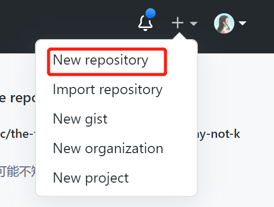
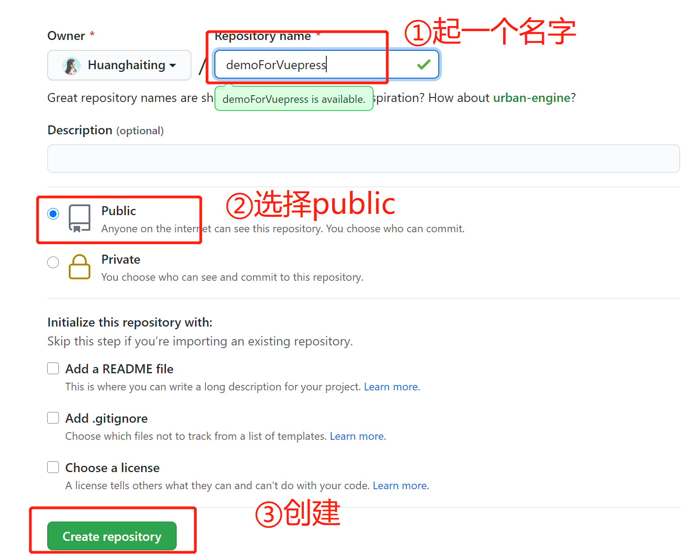
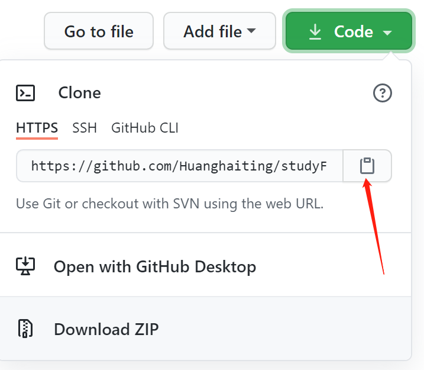
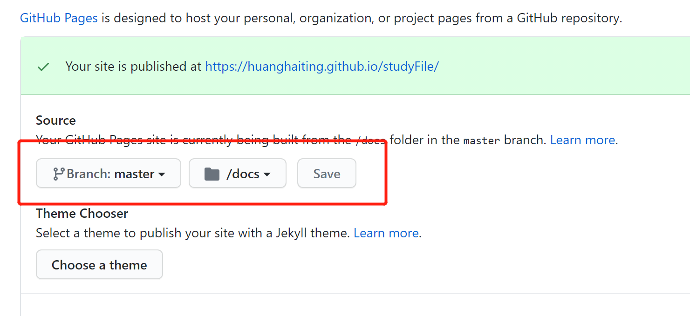

### vuepress 简单搭建

中文文档：https://vuepress.vuejs.org/zh/

①在GitHub上新建repositories：




②输入仓库信息



③将仓库拉取下来



④建目录结构

```
dev
├── docs
│   ├── .vuepress (可选的)
│   │   ├── config.js (可选的)
│   ├── README.md
└── package.json

docs //用于给GitHub pages配置的时候使用
```

⑤在dev文件夹目录下跑terminal

```
使用你喜欢的包管理器进行初始化
yarn init # npm init
```

```bash
将 VuePress 安装为本地依赖
yarn add -D vuepress # npm install -D vuepress
```

```json
在 `package.json` 中添加
{
  "scripts": {
    "docs:dev": "vuepress dev docs",
    //建议将命令改为vuepress dev docs --temp .temp，然后再.gitignore忽略这个暂存文件提交，用于热更新。
    "docs:build": "vuepress build docs"
  }
}
```

在本地启动服务器

```bash
yarn docs:dev # npm run docs:dev
```

VuePress 网站必要的配置文件是 `.vuepress/config.js`，它应该导出一个 JavaScript 对象：

```js
module.exports = {
  title: 'Hello VuePress',
  description: 'Just playing around'
}
```

在此已经完成简单的搭建

⑥将项目打包

在本地启动服务器

```bash
yarn docs:build # npm run docs:build
```

⑦将生成的dist静态文件复制到dev同级的docs文件夹

⑧将项目推送到GitHub

⑨打开仓库的setting，找到GitHub pages设置载入点



⑩等待部署完成即可以预览自己的网站啦~